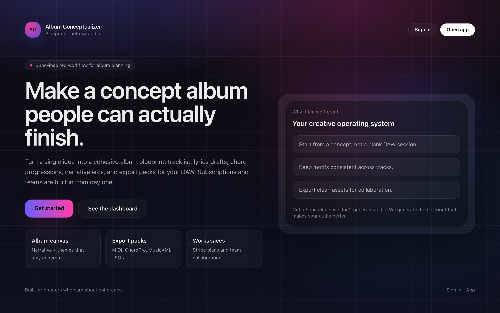

# Album Conceptualizer

<p align="center">
  
</p>

Album Conceptualizer is a full-stack workspace for building coherent concept albums.

It currently includes:

- a Next.js web app for planning, editing, sharing, billing, analytics, and publishing
- a Python FastAPI engine for export, theory, identity, billing, and experience endpoints
- a legacy Gradio UI for local workflows and smoke coverage

The product is strongest at album-level coherence, structure, collaboration, and export handoff. It is not positioned as a one-prompt finished-audio generator.

[](https://www.gnu.org/licenses/gpl-3.0)
[](https://www.python.org/downloads/)

## What This Repo Does

At a high level, the repo supports:

- guided album creation
- album bible generation and editing
- Studio editing for songs, sections, lyrics, and chord progressions
- comments, tasks, notifications, versions, and remix flows
- export to JSON, MIDI, ChordPro, and MusicXML
- public sharing, publishing, Discover, and forking
- billing, credits, daily challenges, and workspace analytics

## Repo Layout

| Path | Purpose |
| --- | --- |
| `apps/web/` | primary Next.js product |
| `album_conceptualizer/` | Python package and FastAPI engine |
| `tests/` | Python pytest suite |
| `docs/` | project documentation |
| `scripts/` | smoke tests, backup, restore, and ops helpers |

## Fastest Local Path

### 1. Install

```bash
uv pip install --system -e ".[dev,music]"
cd apps/web && npm install && cd ..
```

### 2. Start Local Services

```bash
docker compose -f apps/web/docker-compose.local.yml up -d
```

### 3. Configure And Migrate The Web App

```bash
cd apps/web
cp .env.example .env.local
npm run prisma:migrate:deploy
cd ..
```

### 4. Start The Runtimes

Terminal 1:

```bash
make api-dev
```

Terminal 2:

```bash
cd apps/web
npm run dev -- -p 3002
```

Then open:

- `http://127.0.0.1:3002`
- `http://127.0.0.1:3002/sign-in`

Use Dev Login locally when enabled.

## Main Developer Commands

### Python

```bash
make lint
make type-check
make test-cov
```

### Web

```bash
cd apps/web
npm run lint -- .
npm run build
npm run test:e2e
```

### Quality Gates

```bash
bash scripts/web-lighthouse-public.sh
bash scripts/web-lighthouse-auth.sh
cd apps/web && npx -y react-doctor@latest . -y --score
```

## Documentation

The docs are organized by audience:

- [Documentation Home](docs/index.md)
- [Quickstart](docs/getting-started/quickstart.md)
- [What This Repo Does](docs/product/what-it-does.md)
- [Repo Map](docs/developer/repo-map.md)
- [Web Route Reference](docs/developer/web-route-reference.md)
- [Web API Examples](docs/developer/web-api-examples.md)
- [Architecture](docs/developer/architecture.md)
- [Data Model](docs/developer/data-model.md)
- [Architecture Decisions](docs/developer/architecture-decisions.md)
- [Local Development](docs/developer/local-development.md)
- [Testing and Quality](docs/developer/testing-and-quality.md)
- [Runbooks](docs/operations/runbooks.md)
- [Web README](apps/web/README.md)

## Deployment Notes

- The web app is the primary product surface
- The web system of record is Postgres
- The Python engine is a separate service and must be reachable from the web app for export
- The web app should be gated by `/api/health`

Start with:

- [Production Guide](docs/getting-started/production.md)
- [Web Staging Checklist](docs/getting-started/web-staging-checklist.md)

## License

Album Conceptualizer is licensed under the [GNU General Public License v3.0](https://www.gnu.org/licenses/gpl-3.0.en.html).
