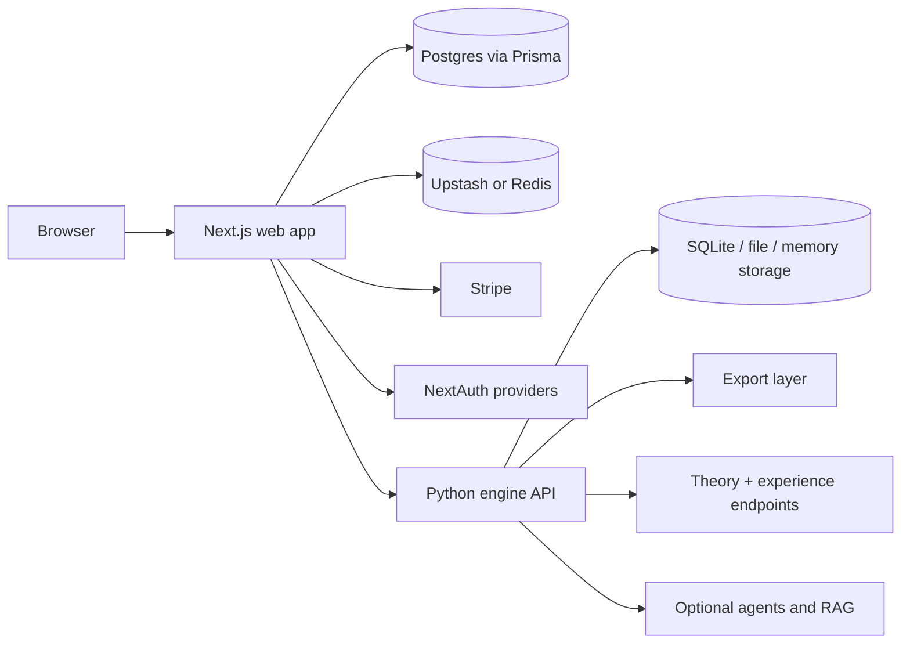

# Architecture

This repo has two primary runtime systems and one legacy UI surface:

- a Next.js web product
- a Python engine API
- a Gradio UI on top of the Python package

The web app is the main user-facing product. The Python engine acts as a supporting service for export and broader API capabilities.

## Runtime Topology

## Architectural Boundaries

### Web App Responsibilities

The web app owns:

- user authentication
- workspaces, albums, songs, sections, comments, tasks, notifications, versions, shares, discover state, subscriptions, and analytics
- the primary user interface
- production health and config gating
- Stripe checkout, billing portal, and webhook handling
- calling the engine for export and preview helpers

The web system of record is Postgres, not the Python API.

### Python Engine Responsibilities

The Python engine owns:

- export format generation
- theory and experience APIs
- optional AI and RAG-backed capabilities
- API-side identity and billing flows used outside the web app
- the legacy Gradio UI

The engine can run with multiple persistence backends depending on environment.

## Main Request Flows

### 1. Authentication And Workspace Bootstrap

1. The browser hits the web app.
2. NextAuth handles sign-in through GitHub, email, or local dev credentials.
3. On first user creation, the app bootstraps a personal workspace and default subscription row.
4. Protected routes are enforced by middleware and server-side identity checks.

Key modules:

- `apps/web/src/server/auth.ts`
- `apps/web/src/server/identity.ts`
- `apps/web/middleware.ts`

### 2. Album Creation And Editing

1. The user creates an album scaffold in the web app.
2. The app persists album, song, and section data into Postgres through Prisma.
3. Bible, coherence, versions, comments, tasks, and notifications are layered on top of that same model.

Key modules:

- `apps/web/src/server/albums.ts`
- `apps/web/src/server/bible.ts`
- `apps/web/src/server/coherence.ts`
- `apps/web/prisma/schema.prisma`

### 3. Export

1. The user opens the export flow in the web app.
2. The web backend assembles the album payload.
3. The web backend calls the Python engine over HTTP.
4. The Python engine generates the export bundle.
5. The web app returns the result to the browser.

Key modules:

- `apps/web/src/app/api/albums/[albumId]/export/route.ts`
- `apps/web/src/server/engine.ts`
- `album_conceptualizer/api/v1/export.py`
- `album_conceptualizer/export/`

### 4. Publish, Discover, And Remix

1. A user publishes an album from the web app.
2. The album becomes visible in the Discover feed.
3. Other users can inspect, share, and fork that album into their own workspace.

Key modules:

- `apps/web/src/app/api/albums/[albumId]/publish/route.ts`
- `apps/web/src/app/app/discover/`
- `apps/web/src/server/album-fork.ts`

### 5. Analytics

The web app tracks product milestones into Postgres so the workspace can show funnel activity and adoption metrics.

Key modules:

- `apps/web/src/server/analytics.ts`
- `apps/web/src/app/api/analytics/album-view/route.ts`
- `apps/web/src/app/app/settings/analytics/page.tsx`

## Data Stores

### Postgres

Primary data store for the web app:

- users
- workspaces
- albums and songs
- sections
- versions
- tasks and notifications
- public discover state
- subscriptions
- analytics events

### Redis Or Upstash

Used on the web side for production rate limiting and related abuse controls.

### Python Storage Backend

The engine can use:

- memory
- file
- SQLite

That is a separate concern from the web app's Postgres data model.

## Production Guardrails

### Web

The web app has strict production validation that can fail health if critical config is missing or unsafe.

Key modules:

- `apps/web/src/server/production.ts`
- `apps/web/src/app/api/health/route.ts`

### Python API

The Python API also has strict production validation through its config layer.

Key module:

- `album_conceptualizer/config.py`

## Why The Split Exists

This architecture lets the web product move fast on:

- auth
- subscriptions
- collaboration
- project persistence
- analytics

while the Python engine stays focused on:

- export
- theory
- optional AI workflows
- API-oriented capabilities

That split is useful, but it also means integration quality matters. The biggest cross-system seam is export.

## The Most Important Architectural Truth

If you are debugging user-facing behavior, start in the web app first.

If you are debugging export payloads or format generation, follow the call into the Python engine.
