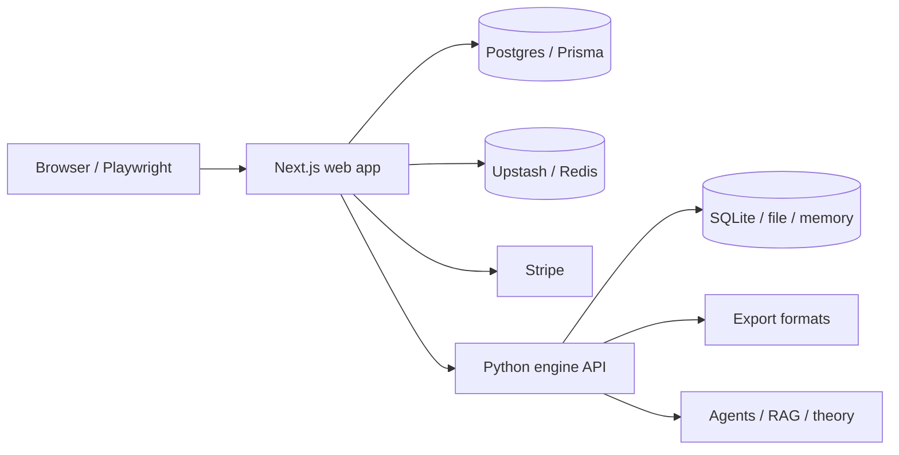

# Album Conceptualizer

Album Conceptualizer is a full-stack workspace for building coherent concept albums.

The repo currently ships three product surfaces:

- A Next.js web app for album planning, studio editing, publishing, remixing, billing, and analytics
- A FastAPI engine for export, theory, billing, identity, and experience endpoints
- A legacy Gradio UI that still works for smoke testing, parity checks, and local workflows

It is strongest at album structure, coherence, lyrics and chord workflows, collaboration, and export handoff. It is not a native Suno or Udio style audio generator.

## Choose Your Path

If you want to:

- run the product locally, start with [Quickstart](getting-started/quickstart.md)
- understand what the product does, read [What This Repo Does](product/what-it-does.md)
- work on the codebase, read [Repo Map](developer/repo-map.md) and [Architecture](developer/architecture.md)
- ship changes safely, read [Testing and Quality](developer/testing-and-quality.md)
- run or operate deployments, read [Runbooks](operations/runbooks.md)

## System At A Glance

## What Lives Here

### Web Product

The web app is the primary product surface. It supports:

- guided album creation
- album bible generation and editing
- track and section editing in Studio
- comments, tasks, versions, notifications, and remix flows
- export handoff through the Python engine
- publishing to Discover, public sharing, and forking
- billing, credits, challenges, and workspace analytics

### Python Engine

The Python package powers:

- FastAPI endpoints under `album_conceptualizer/api/v1`
- export generation for JSON, MIDI, ChordPro, and MusicXML
- theory and experience endpoints
- API identity and billing support
- optional AI and RAG features when the relevant extras are installed

### Legacy UI

The Gradio app remains useful for:

- local demos without the web app
- API and export smoke coverage
- parity checks for older workflows

## Documentation Map

- [Quickstart](getting-started/quickstart.md): fastest path to a working local stack
- [Installation](getting-started/installation.md): dependency and environment setup
- [Production](getting-started/production.md): deployment and staging guidance
- [What This Repo Does](product/what-it-does.md): user-facing capability map
- [Repo Map](developer/repo-map.md): where code lives and where to make changes
- [Web Route Reference](developer/web-route-reference.md): page and API route inventory for the Next.js app
- [Web API Examples](developer/web-api-examples.md): concrete request and response examples for common web routes
- [Architecture](developer/architecture.md): request flow, data flow, and boundaries
- [Data Model](developer/data-model.md): Prisma schema and persistence rules
- [Architecture Decisions](developer/architecture-decisions.md): the major rules that should not be changed casually
- [Local Development](developer/local-development.md): daily development workflow
- [Testing and Quality](developer/testing-and-quality.md): commands, gates, and CI
- [Runbooks](operations/runbooks.md): backups, staging smoke, and operational checks
- [REST API](api/rest-api.md): Python API reference

## Current Launch Read

The repo is locally strong and E2E capable. The main remaining production work is not codebase discoverability anymore, but external validation:

- real auth providers
- real Stripe checkout and webhooks
- deployed export engine validation
- staging and production operations discipline

That is why the docs now separate product understanding, local development, and operations. Each audience needs different answers.
