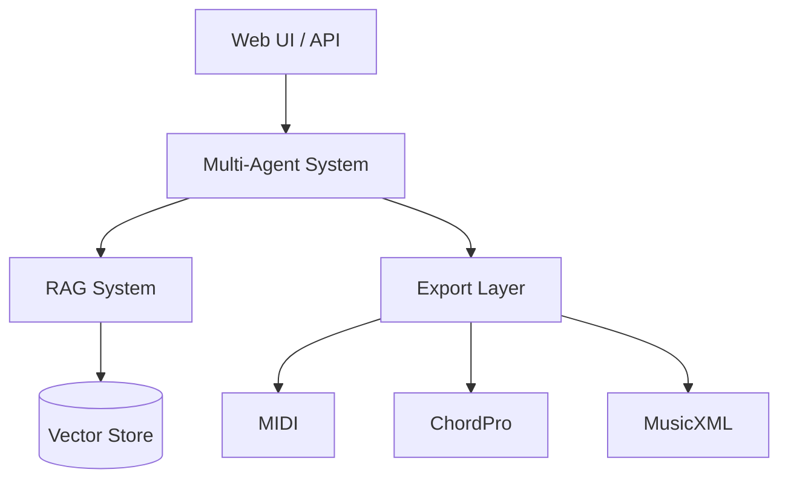

# Album Conceptualizer

A RAG-powered concept album ideation system with multi-agent orchestration.

<div class="grid cards" markdown>

- :material-album: **Create Concept Albums**

    ---

    Design cohesive concept albums with AI-assisted narrative structure,
    thematic tracking, and style consistency.

    [:octicons-arrow-right-24: Getting Started](getting-started/installation.md)

- :material-robot: **Multi-Agent AI**

    ---

    Leverage specialized AI agents (Lyricist, Music Theorist, Narrative
    Specialist) working together via CrewAI.

    [:octicons-arrow-right-24: Production Setup](getting-started/production.md)

- :material-music-note: **Music Theory Tools**

    ---

    Analyze chords, generate scales, and get progression suggestions
    with built-in music theory utilities.

    [:octicons-arrow-right-24: Music Theory API](api/rest-api.md#music-theory)

- :material-export: **Export Anywhere**

    ---

    Export to MIDI, ChordPro, MusicXML, and more for use in your
    favorite DAW or notation software.

    [:octicons-arrow-right-24: Export API](api/rest-api.md#export)

</div>

## What is Album Conceptualizer?

Album Conceptualizer is the **first tool dedicated to concept album creation**.
While AI lyric generators and chord tools exist separately, no other product
addresses the unique challenge of maintaining **narrative and thematic
coherence** across an entire album.

### Key Features

- **Album Bible** - Track themes, characters, motifs, and narrative arcs
- **Hierarchical RAG** - Search at album, song, section, or line level
- **Multi-Agent Workflow** - AI agents collaborate while maintaining coherence
- **Export Flexibility** - MIDI, ChordPro, MusicXML, JSON formats
- **REST API** - Integrate with your existing tools and workflows

## Quick Example

```python
from album_conceptualizer.models.album import Album, Song, Section, SectionType
from album_conceptualizer.models.album_bible import AlbumBible, Theme

# Create an album
album = Album(
    title="The Journey Home",
    artist="The Storytellers",
    concept_summary="A traveler's journey through memory and time",
)

# Create the Album Bible
bible = AlbumBible(
    album_title="The Journey Home",
    logline="A weary traveler discovers that home was within them all along",
)

# Add themes
bible.add_theme(Theme(
    name="Identity",
    description="Who we are when stripped of familiar surroundings",
))

# Create songs
song = Song(
    title="Setting Out",
    track_number=1,
    key="D major",
    tempo=120,
)
song.add_section(Section(
    section_type=SectionType.VERSE,
    order=1,
    lyrics="The morning light breaks through...",
    chord_progression=["D", "A", "Bm", "G"],
))

album.add_song(song)
```

## Architecture



## Installation

=== "uv (Recommended)"

    ```bash
    uv pip install --system -e .
    ```

=== "pip"

    ```bash
    pip install -e .
    ```

=== "Docker"

    ```bash
    docker compose up -d app
    ```

[:octicons-arrow-right-24: Full Installation Guide](getting-started/installation.md)

## License

Album Conceptualizer is licensed under the [GNU General Public License v3.0](https://www.gnu.org/licenses/gpl-3.0.en.html).
